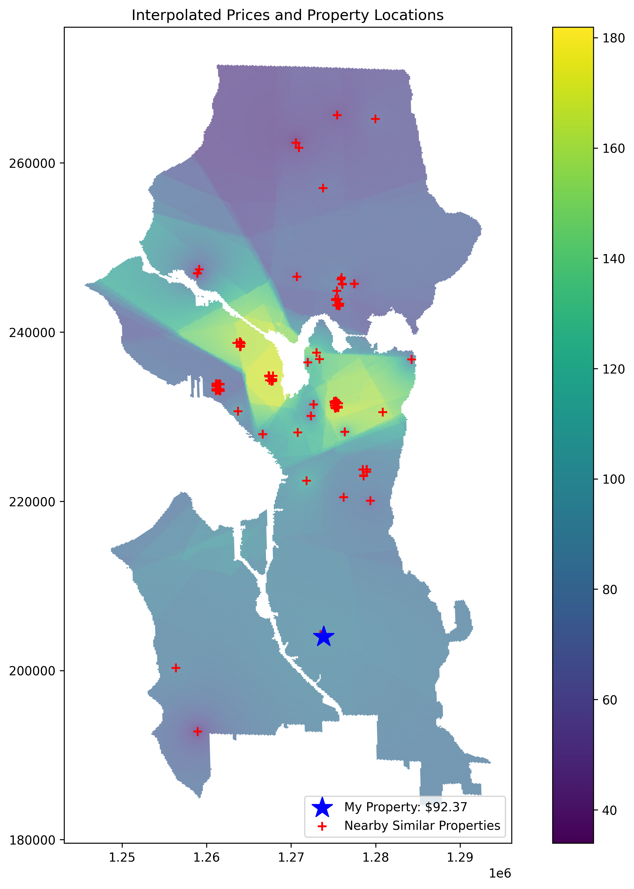

```{r setup, include=FALSE}
# Cargar librerías necesarias
library(flexdashboard)
library(dplyr)    # para manipulación de datos
library(DT)       # para tabla interactiva


# Cargar datos desde el CSV
data <- read.csv("radius_500.csv")

# Extraer el valor numérico de precio recomendado desde el archivo de texto
precio_texto <- readLines("precio.txt", n = 1)  # lee la primera línea del archivo
precio_recomendado <- as.numeric(precio_texto)  # convertir la cadena a número
precio_recomendado <- round(precio_recomendado, 2)  # redondear a 2 decimales 

# Calcular resumen estadístico de los datos
resumen <- data %>%
  summarise(
    Promedio_nearest = mean(nearest, na.rm = TRUE),
    Promedio_IDW_10 = mean(IDW_10, na.rm = TRUE),
    Minimo_IDW_10   = min(IDW_10, na.rm = TRUE),
    Maximo_IDW_10   = max(IDW_10, na.rm = TRUE),
    Cantidad        = n()
  )
```

## Sidebar {.sidebar}

### Precio recomendado
```{r gauge, echo=FALSE}
#  Gauge (medidor) para mostrar el precio recomendado
gauge(precio_recomendado, min = 0, max = 100)
```

## Resultados

### Resumen estadístico
```{r resumen_tabla, echo=FALSE}
# Mostrar la tabla resumen de forma interactiva
DT::datatable(resumen,
              rownames = FALSE,
              colnames = c("Promedio nearest", "Promedio IDW_10",
                           "Mínimo IDW_10", "Máximo IDW_10", "Cantidad de registros"),
              options = list(pageLength = 5, searching = FALSE, paging = FALSE))
```

### Mapa interpolado
```{r mapa_img, echo=FALSE, out.width="100%"}
#  Imagen del mapa interpolado

```